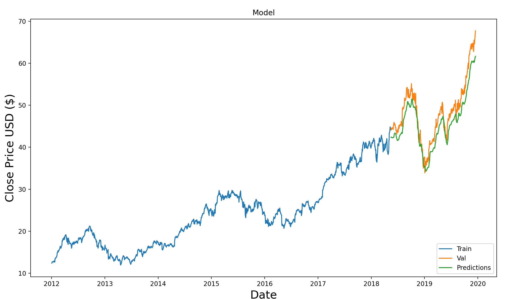

# Stock Price Prediction Model using LSTM 📈

This project demonstrates a stock price prediction model for **Apple Inc. (AAPL)** using a **Long Short-Term Memory (LSTM)** neural network. The model is trained on historical stock price data, and after training, it predicts the future price of Apple stock based on the last 60 days of closing prices.



### **Features 📝**
- **Data Collection:** Fetches historical stock price data for Apple Inc. from Yahoo Finance using the `yfinance` library.
- **Data Preprocessing:** Scales the stock price data using `MinMaxScaler` to improve the performance of the LSTM model.
- **Model Construction:** Uses a Sequential LSTM model with two LSTM layers and a Dense layer for regression.
- **Prediction:** Predicts future stock prices based on the trained model, using the last 60 days of data.
- **Evaluation:** The model is evaluated using **Root Mean Squared Error (RMSE)** to measure prediction accuracy.
- **Visualization:** Visualizes the training data, actual stock prices, and predicted stock prices to assess model performance.
- **New Prediction:** The model can predict the next day's stock price based on the latest 60 days of stock data.

### **Libraries Used 📚**
- `yfinance`: Fetches stock price data from Yahoo Finance.
- `pandas`: Handles and processes the data in DataFrame format.
- `numpy`: Assists with numerical operations and data handling.
- `sklearn.preprocessing.MinMaxScaler`: Scales the stock price data to a range between 0 and 1 for better performance.
- `keras`: Used to build and train the LSTM model.
- `matplotlib`: Plots the stock price history, predicted prices, and model performance.

### **How it Works 🔨**
1. **Data Fetching**  
   The script fetches historical stock data for Apple Inc. from Yahoo Finance (from `2012-01-01` to `2019-12-17`).

2. **Data Preprocessing**  
   - The data is scaled using the `MinMaxScaler` to normalize the prices between 0 and 1.
   - A training dataset (80% of the total data) is used to train the model, and the remaining 20% is used as testing data.

3. **Model Building**  
   The model is built using an LSTM network with two layers:
   - **LSTM Layer 1:** 50 units, returns sequences.
   - **LSTM Layer 2:** 50 units, returns the output for prediction.
   - **Dense Layer:** 25 units for intermediate output.
   - **Output Layer:** A single neuron that predicts the stock price.

4. **Model Training**  
   The model is compiled using the Adam optimizer and Mean Squared Error (MSE) loss function. It is trained using the training data for 1 epoch with a batch size of 1.

5. **Prediction and Evaluation**  
   The model predicts stock prices for the testing data, and RMSE is computed to evaluate the prediction performance.

6. **Visualization**  
   A plot is generated to visualize:
   - The actual stock prices (training vs validation data).
   - The predicted stock prices by the model.

7. **New Price Prediction**  
   The model also predicts the next day’s stock price based on the latest available data.

### **How to Run 🎯**
1. **Install Dependencies**  
   Make sure you have the following libraries installed:
   ```bash
   pip install yfinance numpy pandas scikit-learn keras matplotlib
